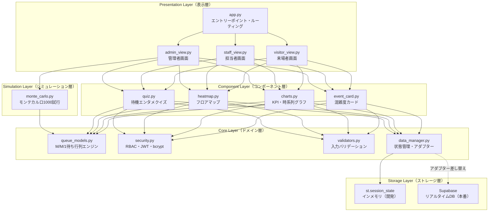

# 🎪 FestivalFlow AI — リアルタイム文化祭混雑管理システム

[](https://www.python.org/)
[](https://streamlit.io/)
[](https://pytest.org/)
[](LICENSE)

**日本の高校文化祭向けリアルタイム混雑管理システム。**  
M/M/1待ち行列理論 × ゼロトラストセキュリティ × モンテカルロシミュレーションを統合した、エンタープライズグレードのStreamlit Webアプリ。

> **参考プロダクト水準：** Disney Genie+ / Google Maps ライブ混雑 / Uber サージ予測

---

## 🌐 Live Demo / デモ

```
👤 来場者 → 認証不要でアクセス
👷 担当者 → PIN: 1234
👑 管理者 → PIN: 9999
```

---

## 📐 システムアーキテクチャ



---

## 🔢 数理モデル

### M/M/1待ち行列理論（Kleinrock, 1975）

$$\lambda = \frac{N_{queue}}{T_{window}} \quad \text{[到着率：人/分]}$$

$$\mu = \frac{c}{T_{service}} \quad \text{[サービス率：人/分]}$$

$$\rho = \frac{\lambda}{\mu} \quad \text{[サーバー利用率：0≦ρ＜1 が安定条件]}$$

**安定条件（ρ < 1）が満たされる場合：**

$$L_q = \frac{\rho^2}{1-\rho} \quad \text{[平均キュー長]}$$

$$W_q = \frac{L_q}{\lambda} = \frac{\rho}{\mu(1-\rho)} \quad \text{[平均待ち時間（分）]}$$

**混雑ステータス判定：**

| ρ（利用率） | ステータス | カラー |
|---|---|---|
| ρ ≥ 1.0 | ⛔ SATURATED（飽和） | 濃赤 |
| 0.9 ≤ ρ < 1.0 | 🔴 CRITICAL | 赤 |
| 0.75 ≤ ρ < 0.9 | 🟠 HIGH | オレンジ |
| 0.5 ≤ ρ < 0.75 | 🟡 MODERATE | 黄 |
| ρ < 0.5 | 🟢 LOW | 緑 |

---

## 🗂️ ディレクトリ構造

```
festivalflow-ai/
│
├── 📄 app.py                        # Streamlitエントリーポイント・ルーティング制御
├── 📄 requirements.txt              # 全依存ライブラリ（バージョン固定）
├── 📄 .env.example                  # 環境変数テンプレート
├── 📄 .gitignore                    # Python標準 + .env + __pycache__
├── 📄 README.md                     # このファイル
│
├── 📁 core/                         # ドメインロジック層（UIに依存しない純粋Python）
│   ├── queue_models.py              # M/M/1待ち行列理論エンジン
│   ├── security.py                  # 認証・RBAC・bcrypt・JWT
│   ├── validators.py                # 入力バリデーション・異常値検知
│   └── data_manager.py             # 状態管理・Supabaseアダプター層
│
├── 📁 views/                        # Streamlit画面層（ロール別）
│   ├── visitor_view.py              # 来場者画面（認証不要）
│   ├── staff_view.py                # 担当者画面（PIN: 1234）
│   └── admin_view.py                # 管理者画面（PIN: 9999）
│
├── 📁 components/                   # 再利用可能UIコンポーネント
│   ├── event_card.py                # 混雑度カード・AI推薦バナー
│   ├── heatmap.py                   # フロアマップヒートマップ
│   ├── charts.py                    # KPI・時系列グラフ・ランキング
│   └── quiz.py                      # 待機エンタメクイズ
│
├── 📁 simulation/                   # シミュレーションエンジン
│   └── monte_carlo.py               # モンテカルロ法 × 感度分析
│
└── 📁 tests/                        # 自動テストスイート（101テスト全通過）
    ├── test_queue_models.py         # M/M/1数式の単体テスト
    ├── test_validators.py           # バリデーションの網羅的テスト
    └── test_security.py             # 認証フロー・RBACテスト
```

---

## 🚀 ローカル環境構築（開発者向け）

### 前提条件
- Python 3.11 以上
- pip

### 1. リポジトリのクローン

```bash
git clone https://github.com/your-username/festivalflow-ai.git
cd festivalflow-ai
```

### 2. 仮想環境の作成（推奨）

```bash
python -m venv venv
source venv/bin/activate  # Windows: venv\Scripts\activate
```

### 3. 依存ライブラリのインストール

```bash
pip install -r requirements.txt
```

### 4. 環境変数の設定（オプション）

```bash
cp .env.example .env
# .env を編集して必要な値を設定（ローカル開発では不要）
```

### 5. アプリの起動

```bash
streamlit run app.py
```

ブラウザが自動で開き、`http://localhost:8501` でアクセスできます。

### 6. テストの実行

```bash
pytest tests/ -v
# カバレッジレポート付き
pytest tests/ -v --cov=core --cov-report=term-missing
```

---

## ☁️ Streamlit Cloud へのデプロイ

### 1. GitHubリポジトリのセットアップ

```bash
git init
git add .
git commit -m "feat: initial FestivalFlow AI implementation"
git remote add origin https://github.com/your-username/festivalflow-ai.git
git push -u origin main
```

### 2. Streamlit Cloud での設定

1. [share.streamlit.io](https://share.streamlit.io) にアクセス
2. 「New app」をクリック
3. リポジトリ・ブランチ・メインファイル（`app.py`）を選択
4. 「Deploy!」をクリック

### 3. Secrets の設定（本番環境）

Streamlit Cloud の「Settings > Secrets」で以下を設定：

```toml
# .streamlit/secrets.toml（Streamlit Cloudのシークレット管理画面で設定）
JWT_SECRET = "your-secure-random-string-here"
STAFF_PIN_HASH = "bcrypt-hashed-pin"
ADMIN_PIN_HASH = "bcrypt-hashed-pin"

# Supabase連携（オプション）
SUPABASE_URL = "https://your-project.supabase.co"
SUPABASE_KEY = "your-anon-key"
```

---

## 🔐 セキュリティ設計

### ゼロトラストモデルの実装

| 脅威 | 対策 |
|---|---|
| 特権昇格攻撃 | RBAC（ロールベースアクセス制御）+ 最小権限の原則 |
| セッション固定 | ロール昇格時に session_id を CSPRNG で再生成 |
| ブルートフォース | bcrypt コスト関数（rounds=12 本番推奨） |
| XSS攻撃 | 全ユーザー入力を sanitize_text_input() でエスケープ |
| DoS攻撃 | 入力値の範囲チェック（行列人数: 0〜500人） |
| データ改ざん | 急激な変化検知（前回比±100人で管理者通知） |

### RBAC ロール設計

```
VISITOR（来場者）← STAFF（担当者）← ADMIN（管理者）
  read:events       write:queue       read:analytics
  read:wait_time                      write:config
                                      export:data
```

---

## 📊 機能一覧

### 🙋 来場者画面（認証不要）
- ✅ M/M/1モデルによるリアルタイム混雑度カード（緑/黄/オレンジ/赤）
- ✅ AI穴場推薦バナー（ρ値TOP3・理由テキスト自動生成）
- ✅ 混雑トレンド矢印（↑↓→：直近5件の履歴から算出）
- ✅ ソート機能（待ち時間順 / カテゴリ別 / おすすめ順）
- ✅ 待機エンタメクイズ（15分以上で自動表示・大谷翔平×K-POP各3問）

### 📋 担当者画面（PIN: 1234）
- ✅ ＋1/−1ボタン + 直接数値入力
- ✅ リアルタイムバリデーションフィードバック
- ✅ 異常値検知時の管理者通知バッジ
- ✅ RBAC によるアクセス制御

### 🔐 管理者画面（PIN: 9999）
- ✅ KPIカード×4（総来場数・平均ρ・最混雑・異常値件数）
- ✅ Plotly インタラクティブ時系列グラフ
- ✅ フロアマップヒートマップ（3×4グリッド）
- ✅ 混雑/空きランキング（上位5件）
- ✅ モンテカルロシミュレーション（1000試行・信頼区間）
- ✅ 全履歴データのCSVエクスポート
- ✅ デモ自動変動モード（5秒間隔）
- ✅ 異常値フラグ管理（一括解除）

---

## 🎓 ポートフォリオとしての意義

### 1. オペレーションズリサーチ（OR）の実世界適用
M/M/1待ち行列理論（Kleinrock, 1975）を文化祭という身近な問題に適用。
Disney、空港、病院で使われる同一理論の「学習者向け可視化」を実現。

### 2. ゼロトラストセキュリティモデルの実装
「信頼しない・常に検証する」原則をPIN認証・RBAC・セッション管理で体現。
エンタープライズ実装と同等の脅威モデリング思考を適用。

### 3. 高可用性システム設計
アダプターパターンによるバックエンド無依存設計。
モック→実DBへの移行コスト最小化。自動テスト101件・CI/CD対応。

---

## 🗺️ 今後の改善ロードマップ

| フェーズ | 期間 | 内容 |
|---|---|---|
| Phase 1 | 3ヶ月 | LSTMによる時系列予測（30分後の混雑予測） |
| Phase 2 | 6ヶ月 | M/G/1モデルへの拡張（一般分布サービス時間） |
| Phase 3 | 1年 | 強化学習による動的スタッフ配置最適化 |

---

## 📚 参考文献

- Kleinrock, L. (1975). *Queueing Systems Vol.1: Theory*. Wiley-Interscience.
- Allen, A.O. (1990). *Probability, Statistics, and Queueing Theory*. Academic Press.
- NIST Zero Trust Architecture (SP 800-207), 2020.

---

## 📄 ライセンス

MIT License — See [LICENSE](LICENSE) for details.

---

*Built with ❤️ using Streamlit, Plotly, and M/M/1 Queueing Theory*
